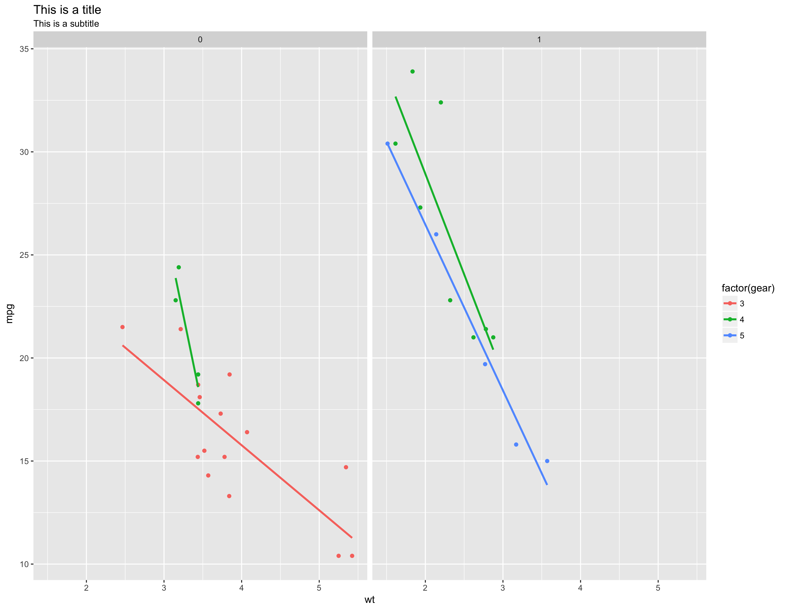
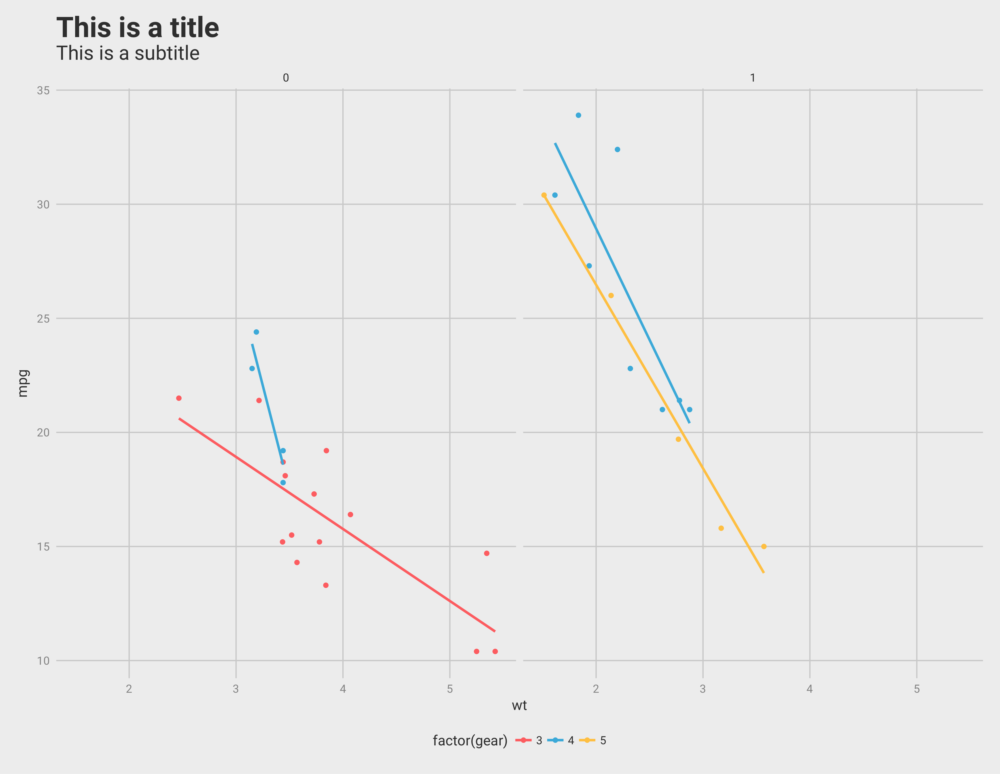

# kani
Personal R Package to help me in my analysis

# Installation
```r
devtools::install_github("kanishkamisra/kani")
```

# Example

* With vanilla ggplot:

```r
library(ggplot2)
p <- ggplot(mtcars, aes(wt, mpg, color = factor(gear))) +
  geom_point() +
  facet_wrap(~am) +
  geom_smooth(method = "lm", se = FALSE) +
  labs(title = "This is a title", subtitle = "This is a subtitle")
```



* With the kani theme:

```r
library(ggplot2)
p <- ggplot(mtcars, aes(wt, mpg, color = factor(gear))) +
  geom_point() +
  facet_wrap(~am) +
  geom_smooth(method = "lm", se = FALSE) +
  labs(title = "This is a title", subtitle = "This is a subtitle") +
  scale_color_kani() + 
  theme_kani()
```

